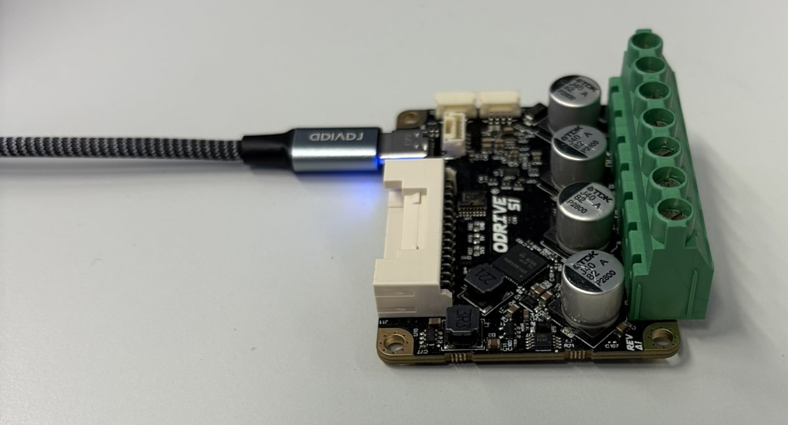
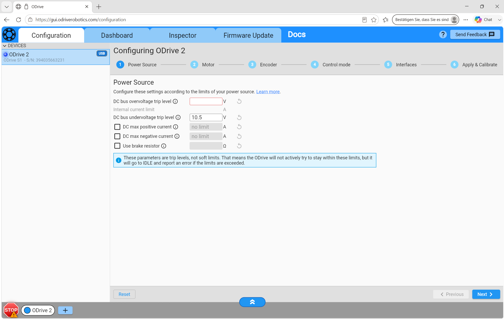
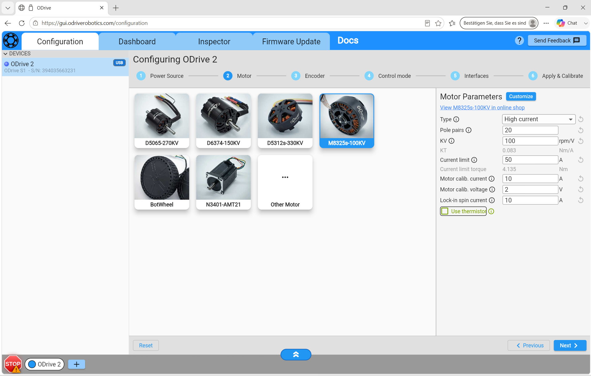
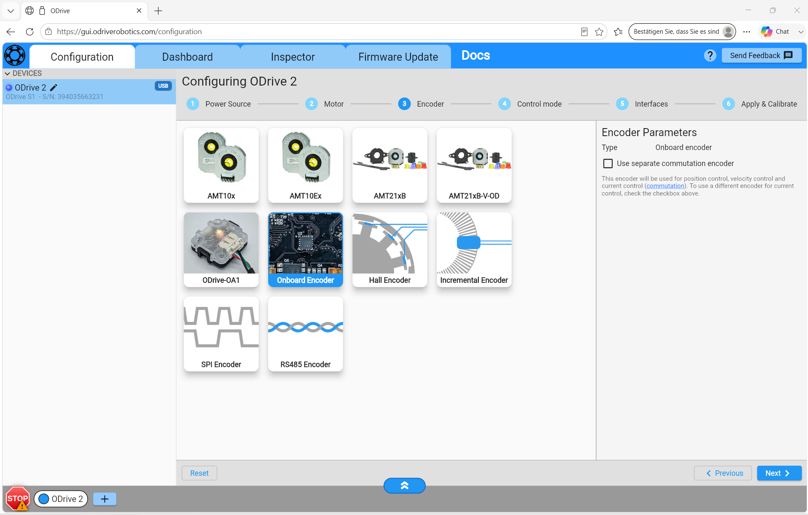
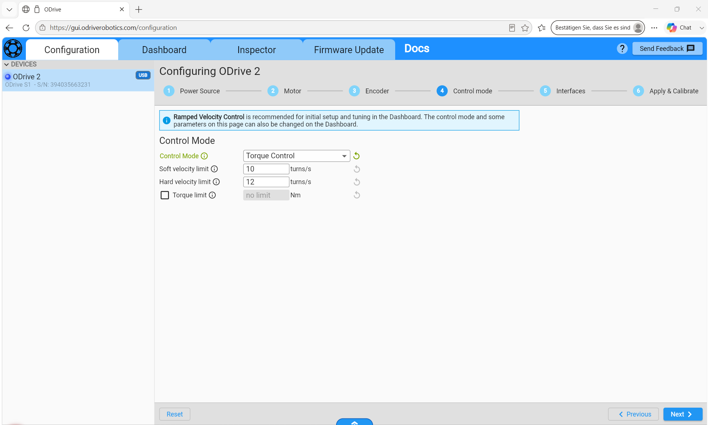
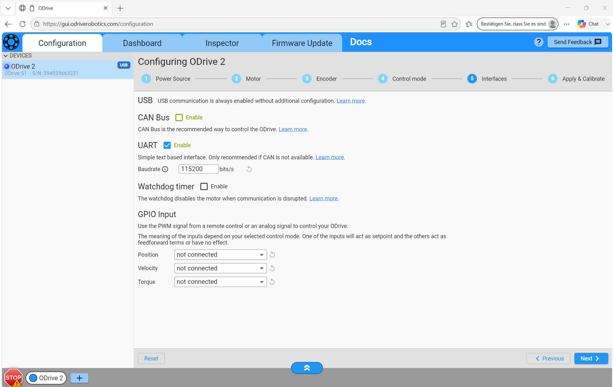
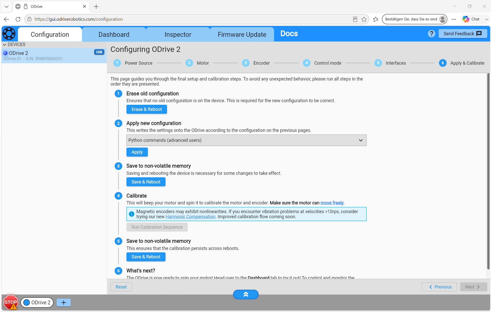
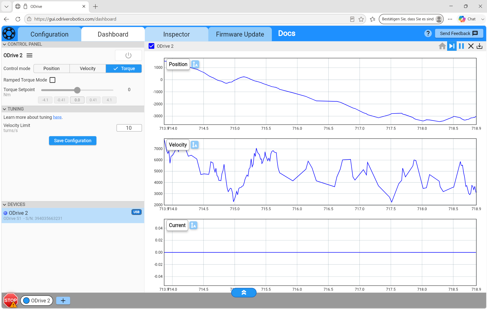
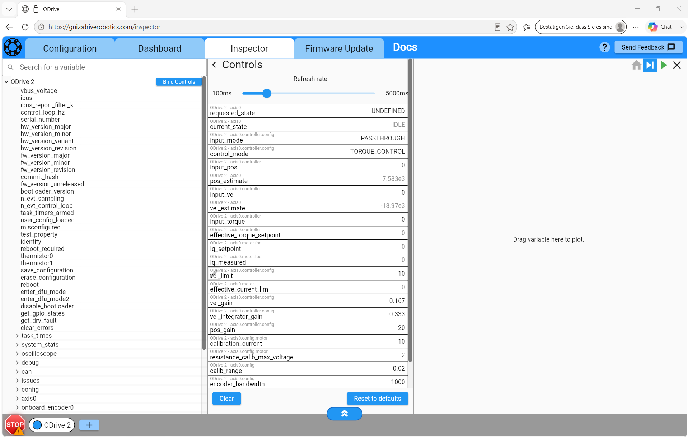

# Anleitung: Konfiguration der ODrive S1 Shields

> **Anmerkung**  
>Als Isolation zwischen den Motorschilden und dem Roboterchassis wird aktuell nur Papier genutzt und müsste bevor die Motoren höher bestromt werden durch einen passenden Isolator getauscht werden

---

## 1. Übersicht

In dieser Anleitung wird Beschrieben wie die Odrive Motorschilde konifguriert werden und auf was dabei zu achten ist.

### Verwendete Hardware

| Komponente | Beschreibung |
|---|---|
| ODrive S1 | Motorcontroller |
| Motor | M8325s-100KV |
| Spannungsversorgung | Akku, 24-28 V |
| Steuergerät | Teensy|
| Verbindung |  UART |

### Verwendete Software

| Software | |
|---|---|
| ODrive GUI | Konfiguration und Diagnose |
| Firmware | 0.6.12 |

---

## 2. Anschluss des ODrive S1

Die beiden Odrive S1 Controller sind via UART mit dem Teensy 4.0 verbunden. Für die beiden Verbindungen werden als Serial1 Pin 0,1 und Serial2 Pin 7,8 verwendet. Hier ist anzumerken, dass es bei der Verwendung von Wago-Klemmen zu Problemen kommen kann. Der Verbindungsaufbau via UART hat beim verwenden von zwei Kammern der Klemme nicht funktioniert während das pressen beider Verbindungskabel in eine Kammer die Verbindung ermöglicht. 

---

## 3. Verbindung mit der ODrive GUI

1. Verbindung via USB-Kabel herstellen
2. ODrive GUI öffnen. (https://gui.odriverobotics.com/configuration, am besten Microsoft Edge)
3. Prüfen, ob das Board erkannt wird

## 4. Konfiguration
Wenn der Odrive Ordnungsgemäß angeschlossen und in der GUI erkannt wird hat man anschließend die Möglichkeit den ODrive zu Konfigurieren. 

---
### 4.1 Power Source

Hier sind die Spannungsgrenzen der Versorgung einzustellen, die Überspannungsgrenze wird auf 48- und die Unterspannungsgrenze auf 20 Volt gestellt.

---
### 4.2 Motor

Bitte den M8325s-100KV auswählen, die voreingestellten Werte könne behalten werden, einzig "Use Thermistor" muss deaktiviert werden.

---
### 4.3 Encoder

Als Encoder verwendet Roboter den Onboard Encoder der Odrives. Wichtig zu beachten ist, dass das Motorschild so nah wie möglich an dem Motor installiert werden muss, dass dieser nicht durch die Motorströme gestört wird.

---

### 4.4 Control Mode

Der Control Mode muss von Velocity- auf Torque Control geändert werden.

---

### 4.5 Interfaces

Hier wird die verwendete Kommunikationsart zwischen Teensy und Odrive festgelegt. Die Voreinstellung CAN Bus kann deaktiviert und dafür UART aktiviert werden. Hierbei bitte drauf achten, dass als Baudrate 115200 bits/s

---

### 4.6 Apply & Calibrate

Einfach von Oben nach Unten durcharbeiten, manchmal muss die Kalibrierung ein zweites mal gestartet werden um Orndungsgemäß durchzulaufen.

---
## 5. Weitere Masken

### 5.1 Dashboard
Unter Dashboard ist eine einfache Signalmonitor der wichtigsten Größen des Motorschildes zu sehen. Über die Start und Stop Taste kann ein gewünschter Ausschnitt angeschaut werden, im Zeitverlauf umherscrollen ist nicht möglich.

### 5.2 Inspector
Im Inspector können alle Werte/Parameter des Odrives verändert beziehungswiese eingesehen werden. 

---

