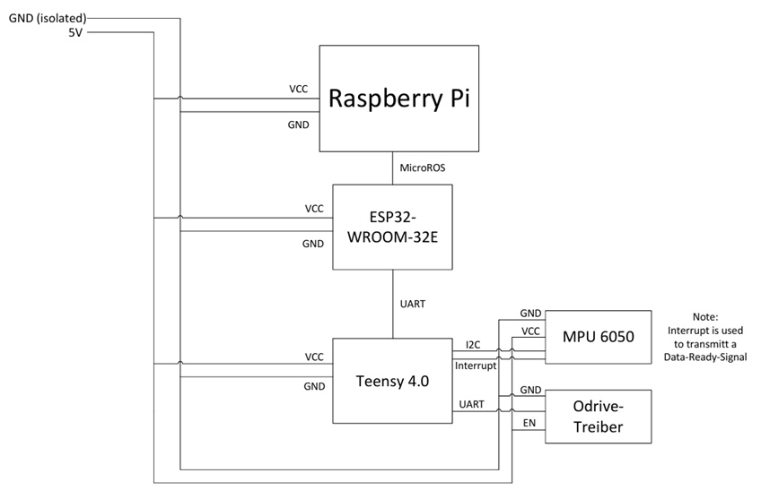

# Self-Balancing Robot – StabilOHM

## Inhaltsverzeichnis
- [Projekterweiterung](#projekterweiterung)
- [Technische Umsetzung](#technische-umsetzung)
- [Steuerung und Regelung](#steuerung-und-regelung)
- [Bilder und Videos](#bilder-des-roboters)
- [Komponenten-Erweiterung](#komponenten-erweiterung)
- [Schaltskizze](#schaltskizze)
- [Micro-ROS](#micro-ros)
- [Raspberry Pi](#raspberry-pi)
- [Fernsteuerung des Roboters](#fernsteuerung-des-roboters)
- [Wireless-Notaus](#not-aus-system)
- [Zusammenfassung der Erweiterungen](#zusammenfassung-der-erweiterungen)
- [Herausforderungen und Probleme](#herausforderungen-und-probleme)
- [Mögliche Erweiterungen](#mögliche-erweiterungen)
- [Erste Schritte](#erste-schritte)
- [Fazit](#fazit)


---

## Projekterweiterung  

Das Ziel dieses Projekts war es, einen selbstbalancierenden zweirädrigen Roboter mit Differentialantrieb zu erweitern. Hierfür wurden die Vorschläge der vorherigen Gruppe als Startbasis übernommen. Die Hauptaufgabe bestand darin, den **Regelalgorithmus** von einem PID-Regler auf einen **Zustandsregler** umzustellen. Dies ermöglicht ein präziseres Eingreifen in den Regelzyklus und eine flexible Anpassung an die jeweiligen Anforderungen.  

Zusätzlich wurde die Thematik von **Micro-ROS** aufgegriffen, um eine Fernsteuerung des Roboters und die Weitergabe der Sensordaten zu ermöglichen. Diese Erweiterung ist essenziell für einen zukünftigen autonomen Betrieb des Roboters.  

Neben den elektrischen und softwareseitigen Erweiterungen wurden auch Maßnahmen für einen sicheren Betrieb implementiert. Dazu zählen die Implementierung eines **Not-Aus-Systems**, eine **Spannungsüberwachung** sowie eine **Ladevorrichtung**. Diese Maßnahmen gewährleisten, dass der Roboter jederzeit in einem sicheren Zustand betrieben werden kann.

### Motivation

Ein selbstbalancierender Roboter ist sowohl für die Robotik als auch für die Regelungstechnik eine spannende Herausforderung. Für eine korrekte Implementierung müssen Hardware, Software und Regelungstechnik zusammenarbeiten. Die Bearbeitung dieser Problemstellungen vermittelt ein tiefes Verständnis für alle drei Disziplinen sowie für die Integration aller Komponenten unter Echtzeitbedingungen.  

### Technische Umsetzung

Die Hardware der vorherigen Gruppe wurde nur minimal erweitert. Neben einem **Teensy 4.0** wurde ein **ESP32** implementiert, dessen Aufgaben im späteren Abschnitt näher beschrieben werden.  

Der Schwerpunkt lag auf der **Optimierung der Hardwareverkabelung** und der Anordnung der Komponenten. Ziel war es, Masseschleifen zu reduzieren, einen galvanisch getrennten Steuerkreis zu schaffen und Komponenten besser gegen Stöße und Vibrationen zu schützen.  

### Steuerung und Regelung

Die Regelung wurde auf einen **Zustandsregler** umgestellt. Ein Zustandsregler berechnet die Stellgröße aus einer gewichteten Rückführung der **Systemzustände**, wodurch das dynamische Verhalten gezielt über Polplatzierung oder Optimierung beeinflusst werden kann.  

Die Systemzustände werden wie folgt gebildet:

$x_1' = x_2$  
$x_2' = \frac{-g \cdot \sin(x_1) + \ddot{p} \cdot \cos(x_1)}{L \cdot \frac{2}{3}}$  
$x_3 = p$  
$x_4 = x_3'$  
$\ddot{p} = x_4' = -\frac{x_4}{\tau} + \frac{K_x \cdot i_{\text{soll}}}{\tau}$

Mit den Koeffizienten:  
- g = 9,81 m/s²  
- L = 0,3 m (Abstand vom Radmittelpunkt bis zum Schwerpunkt)  
- tau = Regelverzögerung  
- K_x = Stellgrößenfaktor  

Für die Regelung wurde die Polstelle auf **S = -6,4** simuliert, um bei den kleinen Rädern eine schnelle Reaktion auf Winkel- und Positionsabweichungen zu gewährleisten.  

Zusätzlich wurde ein **Kalmanfilter** implementiert, um das Gyroskop-Signal zu filtern. Ohne diesen Filter war die Regelung extrem instabil, da das Rohsignal stark verrauscht ist. Der Kalmanfilter wirkt hier wie ein speziell zugeschnittener Tiefpass.  

---

### Bilder des Roboters


## Bilder und Videos
Sämtliche Bilder und Videos sind in den entsprechenden Ordnern einsehbar.  

---

## Komponenten-Erweiterung  

### ESP32
Der ESP32 ist ein kosteneffizienter Microcontroller mit umfangreicher Funktionalität. Er fungiert als Kommunikationsschnittstelle zwischen **ROS** und dem Teensy 4.0.  

Der Controller wurde mit **RTOS** eingerichtet, wodurch zwei verschiedene Aufgaben gleichzeitig bearbeitet werden können:  
- Micro-ROS für die Kommunikation mit dem Raspberry Pi  
- UART-Kommunikation mit dem Teensy  

Dadurch wird der Regelzyklus des Teensy nicht durch die Kommunikation blockiert und kann unabhängig arbeiten.  

### Traco Power DC-DC
Ein Traco Power DC/DC-Wandler wandelt eine Eingangsspannung von 24 V DC in eine stabile Ausgangsspannung von 5 V DC um. Er wird zur zuverlässigen Versorgung von elektronischen Geräten wie Mikrocontrollern, Sensoren oder Steuerungen eingesetzt. Durch seinen hohen Wirkungsgrad arbeitet er energieeffizient und entwickelt nur wenig Wärme.

---

## Schaltskizze  

---

## Micro-ROS  

**Micro-ROS** ist eine Erweiterung von ROS 2 für eingebettete Systeme mit begrenzten Ressourcen. Es ermöglicht Microcontrollern, direkt mit dem ROS-Ökosystem zu kommunizieren.  

Für die Verwendung muss in der Arduino IDE ein entsprechendes Add-On installiert werden. Für den ESP32 kann die Library direkt aus der IDE genutzt werden. Für den Teensy 4.0 muss eine **ältere Micro-ROS-Version** verwendet werden. Weitere Informationen: [Micro-ROS auf Teensy](https://micro.ros.org/docs/tutorials/core/teensy_with_arduino/).  

### RTOS
Für Micro-ROS wird grundsätzlich die Nutzung eines **RTOS** empfohlen, um Micro-ROS als separate Task neben der Hauptapplikation auszuführen. Ohne RTOS (Superloop-Architektur) startet der Loop erst, wenn der Micro-ROS-Agent aktiv ist, und die Zykluslaufzeit wird stark beeinflusst.  

### Micro-ROS-Agent
Der Micro-ROS-Agent wird benötigt, um Publisher und Subscriber zu erstellen. Die Inbetriebnahme erfolgt über USB Micro-B:

```bash
# ROS2-Umgebung einrichten
source /opt/ros/jazzy/setup.bash

# In den Workspace wechseln
cd ros2_ws
source install/setup.bash

# Micro-ROS-Agent starten
ros2 run micro_ros_agent micro_ros_agent serial --dev /dev/ttyACM0
```

Die Schnittstelle /dev/ttyACM0 muss ggf. mit lsusb überprüft werden. Im Terminal sollten Meldungen über die erstellten Publisher und Subscriber erscheinen. Über ros2 topic list kann die Funktionalität überprüft werden.

---

## Raspberry Pi
Der Raspberry Pi wurde mit **Linux Ubuntu LTS Server** eingerichtet, um die Kompatibilität mit ROS2 Jazzy sicherzustellen. Ein Workspace mit grundlegenden Knoten wurde eingerichtet:

- **Core-Node**: zentrale Verarbeitung aller Subscriber  
- **Lidar-Node**: sammelt Lidardaten und veröffentlicht sie über `/scan`  
- **Control-Node**: interpretiert Fernsteuerungsdaten (z. B. Xbox-Controller)  
- **Not-Aus-Node**: überwacht Not-Aus-Zustände (derzeit noch nicht funktionsfähig)
- **MicroRos-Agent**: Starten von MicroRos 

---

## Fernsteuerung des Roboters

Zur Fernsteuerung des Roboters über einen Controller wurde das ROS2-Paket **`joy`** verwendet. Dieses muss in einem separaten Terminal gestartet werden und ist notwendig, um die **Controller-Node** auszuführen:
```bash
ros2 run joy joy_node
```
Die Verwendung von joy hängt vom Controller-Typ ab und ist nicht zwingend erforderlich. Für die in den Versuchen verwendete Xbox 360 Controller war der Start der Joy-Node jedoch notwendig.

### Ablauf der Steuerung

1. **Joy-Node starten**  
   Startet die Schnittstelle zum Controller und veröffentlicht die Eingaben über das Topic `/joy`.
   ```bash
   ros2 run joy joy_node
   ```

3. **Controller-Node starten**  
   Interpretiert die Controller-Daten und wandelt diese in Steuerbefehle für den Roboter um.
   ```bash
   ros2 run controller controller_node
   ```
5. **Core-Node starten**  
   Zentrale Verarbeitung aller Nachrichten und Weiterleitung an die entsprechenden Sub- und Publisher.
   ```bash
   ros2 run core core_node
   ```

7. **Micro-ROS-Agent starten**  
   Verbindet die Steuerbefehle vom Raspberry Pi über den Micro-ROS-Agenten mit dem Microcontroller (Teensy/ESP32).
   ```bash
   ros2 run micro_ros_agent micro_ros_agent serial --dev /dev/ttyUSB1
   ```


## Not-Aus-System

Der Zustand des Not-Aus wird über einen ESP32 per UDP an den Raspberry Pi übertragen. Ein ROS2-Node empfängt die UDP-Daten und veröffentlicht den Zustand als `std_msgs/msg/Bool`.

### Ablauf des Not-Aus

1. **UDP-Receiver-Node starten**  
   Empfängt den Zustand des ESP32 über UDP-Port `5005` und veröffentlicht diesen auf dem Topic `/esp/bit`.

   ```bash
   ros2 run bit_receiver_node bit_receiver_node
   ```

2. **Not-Aus-Zustand prüfen**  
   Der aktuelle Zustand des Not-Aus kann über das Topic `/esp/bit` überprüft werden.

   ```bash
   ros2 topic echo /esp/bit
   ```

3. **Integration in den Fahrbetrieb**  
   Der Node für den Fahrbetrieb muss das Topic `/esp/bit` vom Typ `std_msgs/msg/Bool` subscriben. Abhängig vom empfangenen Zustand werden Fahrbefehle freigegeben oder gesperrt.


---

## Herausforderungen und Probleme

### 1. Umsetzung des Zustandsreglers
Die größte Herausforderung lag in der Realisierung eines stabilen Zustandsreglers. Besonders problematisch waren die verrauschten Gyroskop-Daten, die die Regelung erschwerten. Zudem stellte es sich als schwierig heraus, die Positionsabweichung auf einen kleinen Radius zu reduzieren.  

Ein noch bestehender Fehler ist, dass sich die Räder beim Balancieren teilweise unterschiedlich schnell drehen, wodurch das System beginnt, sich zu drehen. Vermutet wird, dass die Motoren oder deren Treiber die Stellgrößen des Reglers unterschiedlich umsetzen – entweder aufgrund unterschiedlicher Reaktanzen der Motoren oder durch Fertigungstoleranzen der Treiberbaugruppe.  

### 2. Implementierung der Fernsteuerung
Ein weiteres Problem war die Integration der Fernsteuerung. Zunächst wurde versucht, alles über den **Teensy 4.0** zu realisieren. Dies erwies sich jedoch in Kombination mit **MicroROS** als problematisch. Anschließend wurde die Hardware auf einen **ESP32** umgestellt, was grundsätzlich funktionierte.  

Allerdings wurden allein für die Umsetzung des Reglers die beiden Kerne des ESP32 vollständig ausgelastet. Das Hinzufügen einer MicroROS-Task niedriger Priorität mit langsamer Wiederholrate führte dazu, dass der Regler instabil wurde. Zudem wurde die MicroROS-Task nur alle 2–3 Sekunden aufgerufen, was die Messdaten für die weitere Verarbeitung nahezu unbrauchbar machte.  

Das Fazit war, zwei Mikrocontroller zu verwenden, die sich gegenseitig nicht beeinflussen. So kann der Regelzyklus stabil bleiben und die Daten können in Echtzeit übertragen werden.  

### 3. Raspberry Pi
## Hotspot
Bei der Nutzung des Raspberry Pi als Hotspot traten ebenfalls kleinere Probleme auf. Für die Funkverbindung wurde eine Alfa Network Antenne eingesetzt. Bei Tests mit der Übertragung von ROS-Messdaten funktionierte dies zunächst nicht zuverlässig. Teilweise konnte das Problem durch Aktivierung von Multicast-to-Unicast in den Einstellungen gelöst werden, was die Übertragung kleiner Datenmengen ermöglichte. Die Lidar-Daten wurden jedoch oft fehlerhaft oder gar nicht übertragen. Dieses Problem tritt nur bei der Übertragung über die Antenne auf. Vermutlich ist die Bandbreite zu gering um große und muss ggf. ausgetauscht werden.

---

## Mögliche Erweiterungen

### Projektarbeit 1 – Softwareseitige Erweiterung durch autonome Regelung
- **Fusion von Umgebungs- und Bewegungsdaten**: Lidardaten und Gyroskop-Winkel müssen fusioniert werden, um genaue Umgebungsinformationen zu erhalten.  
- **Autonome Navigation & Kartographierung (SLAM)**: Langfristige Erweiterung zur eigenständigen Kartierung und Navigation.  
- **Not-Halt und Not-Aus**: Kombination von Hard- und Software zur sicheren Reaktion auf kritische Situationen.  

### Projektarbeit 2 – Mechanische Optimierung und Not-Aus-System
- **Mechanische Verkleidung**: Schutz der Elektronik, wartungsfreundlich, strukturell stabil  
- **Passive Sicherheitsmaßnahmen**: Umfallschutz durch Stützrollen oder dämpfende Strukturen  
- **Integration eines Roboterarms**: Interaktion mit der Umgebung  

---

## Erste Schritte

---

## Fazit
Die Projekterweiterung des Self-Balancing Roboters StabilOHM umfasst sowohl Hardware- als auch Softwareoptimierungen, die Regelung auf Zustandsregler, Micro-ROS Integration und Sicherheitsmaßnahmen. Dies schafft die Grundlage für eine zukünftige autonome Anwendung.
